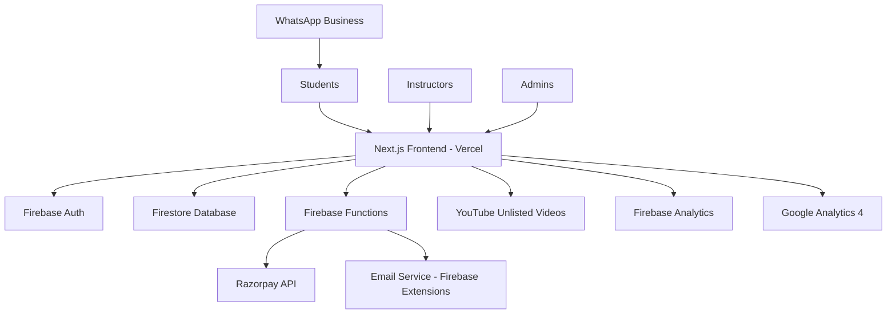
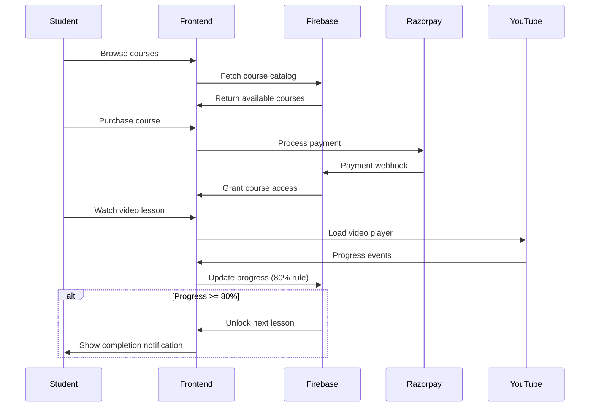

# Hindustani Tongue LMS - Free-Stack Design Document

## Overview

This design document outlines a minimal, cost-effective architecture for the Hindustani Tongue LMS that operates entirely on free tiers and services. The system focuses on delivering the core 80% video completion experience while generating revenue through Razorpay payments, all while maintaining zero operational costs until the business proves viability.

The architecture prioritizes simplicity, maintainability, and staying within free tier limits while providing a professional learning experience that can scale to 500 active users before requiring paid upgrades.

## Architecture Overview

### High-Level System Architecture



### Data Flow Architecture



## Technical Components

### 1. Frontend Application (Next.js on Vercel)

**Purpose:** Single-page application handling all user interactions, course delivery, and video progress tracking.

**Key Features:**
- Responsive design for mobile and desktop
- Server-side rendering for SEO optimization
- YouTube IFrame API integration for video tracking
- Real-time progress updates using Firebase SDK
- Razorpay payment integration

**Architecture:**
```typescript
// Core application structure
src/
├── app/                    // Next.js 13+ app directory
│   ├── (auth)/            // Authentication pages
│   ├── courses/           // Course browsing and viewing
│   ├── dashboard/         // Student/instructor dashboards
│   ├── admin/             // Admin panel
│   └── api/               // API routes for webhooks
├── components/            // Reusable UI components
│   ├── VideoPlayer/       // Custom YouTube player
│   ├── CourseCard/        // Course display component
│   └── ProgressBar/       // Progress visualization
├── lib/                   // Utility functions
│   ├── firebase.ts        // Firebase configuration
│   ├── razorpay.ts        // Payment processing
│   └── youtube.ts         // Video player utilities
└── hooks/                 // Custom React hooks
    ├── useVideoProgress.ts // Progress tracking logic
    └── useAuth.ts         // Authentication state
```

**Free Tier Limitations:**
- 100GB bandwidth/month (≈10,000 page views)
- Unlimited build minutes
- Automatic HTTPS and domain support

### 2. Firebase Backend Services

#### Firebase Authentication
**Purpose:** User management and authentication for students, instructors, and admins.

**Configuration:**
```typescript
// Firebase Auth setup
const authConfig = {
  providers: ['email/password'], // Only email auth for simplicity
  sessions: 30, // 30-day session length
  emailVerification: true,
  passwordReset: true
}

// User roles stored in custom claims
interface UserClaims {
  role: 'student' | 'instructor' | 'admin';
  enrolledCourses?: string[];
  createdAt: number;
}
```

#### Firestore Database
**Purpose:** Store all application data including courses, user progress, payments, and analytics.

**Schema Design:**
```typescript
// Collection: users/{userId}
interface User {
  uid: string;
  email: string;
  displayName: string;
  role: 'student' | 'instructor' | 'admin';
  enrolledCourses: string[];
  createdAt: Timestamp;
  lastLoginAt: Timestamp;
  totalWatchTime: number;
  completedLessons: string[];
}

// Collection: courses/{courseId}
interface Course {
  id: string;
  title: string;
  description: string;
  instructorId: string;
  price: number; // in paise (INR)
  currency: 'INR';
  thumbnail: string;
  status: 'draft' | 'published' | 'archived';
  lessons: Lesson[];
  totalDuration: number; // in seconds
  enrollmentCount: number;
  rating: number;
  createdAt: Timestamp;
}

// Sub-collection: courses/{courseId}/lessons/{lessonId}
interface Lesson {
  id: string;
  title: string;
  description: string;
  youtubeVideoId: string;
  duration: number; // in seconds
  order: number;
  isPreview: boolean; // free preview lesson
  learningObjectives: string[];
}

// Collection: userProgress/{userId}_{courseId}
interface UserProgress {
  userId: string;
  courseId: string;
  enrolledAt: Timestamp;
  lastAccessedAt: Timestamp;
  currentLessonId: string;
  lessonsCompleted: string[];
  totalWatchTime: number;
  overallProgress: number; // 0-100 percentage
  lessonProgress: Record<string, LessonProgress>;
}

interface LessonProgress {
  lessonId: string;
  watchedSeconds: number;
  totalSeconds: number;
  completionPercentage: number;
  isCompleted: boolean; // true when >= 80%
  lastWatchedAt: Timestamp;
  sessionCount: number;
}

// Collection: payments/{paymentId}
interface Payment {
  id: string;
  razorpayPaymentId: string;
  userId: string;
  courseId: string;
  amount: number;
  currency: 'INR';
  status: 'created' | 'authorized' | 'captured' | 'refunded' | 'failed';
  createdAt: Timestamp;
  metadata: {
    userEmail: string;
    courseTitle: string;
  };
}
```

**Free Tier Optimization:**
```typescript
// Firestore usage optimization
const firestoreConfig = {
  // Batch writes to reduce write operations
  batchSize: 10,
  // Cache frequently accessed data
  cacheSettings: {
    courses: '1h',
    userProgress: '10m'
  },
  // Compound indexes for efficient queries
  indexes: [
    ['courses', 'status', 'createdAt'],
    ['userProgress', 'userId', 'lastAccessedAt'],
    ['payments', 'userId', 'createdAt']
  ]
}
```

#### Firebase Functions
**Purpose:** Server-side logic for payment processing, user management, and data validation.

**Key Functions:**
```typescript
// Payment processing webhook
export const handleRazorpayWebhook = functions.https.onRequest(async (req, res) => {
  const signature = req.headers['x-razorpay-signature'];
  const payload = req.body;
  
  // Verify webhook signature
  const isValid = razorpay.utils.validateWebhookSignature(payload, signature, webhookSecret);
  
  if (isValid && payload.event === 'payment.captured') {
    // Grant course access
    await grantCourseAccess(payload.payment.metadata.userId, payload.payment.metadata.courseId);
  }
  
  res.status(200).send('OK');
});

// Progress tracking with 80% rule enforcement
export const updateVideoProgress = functions.firestore
  .document('userProgress/{progressId}')
  .onUpdate(async (change, context) => {
    const newProgress = change.after.data();
    const oldProgress = change.before.data();
    
    // Check if any lesson reached 80% completion
    for (const [lessonId, progress] of Object.entries(newProgress.lessonProgress)) {
      if (progress.completionPercentage >= 80 && !progress.isCompleted) {
        await unlockNextLesson(newProgress.userId, newProgress.courseId, lessonId);
      }
    }
  });

// User enrollment and access control
export const enrollUserInCourse = functions.https.onCall(async (data, context) => {
  const { userId, courseId, paymentId } = data;
  
  // Verify payment
  const payment = await admin.firestore().doc(`payments/${paymentId}`).get();
  if (!payment.exists || payment.data().status !== 'captured') {
    throw new functions.https.HttpsError('failed-precondition', 'Payment not verified');
  }
  
  // Add course to user's enrolled courses
  await admin.firestore().doc(`users/${userId}`).update({
    enrolledCourses: admin.firestore.FieldValue.arrayUnion(courseId)
  });
  
  return { success: true };
});
```

### 3. Video Player System

**Purpose:** Custom YouTube player integration with precise progress tracking for the 80% completion rule.

**Implementation:**
```typescript
// Custom video player hook
export const useVideoProgress = (lessonId: string, courseId: string) => {
  const [player, setPlayer] = useState<YT.Player | null>(null);
  const [progress, setProgress] = useState<LessonProgress | null>(null);
  const { user } = useAuth();
  
  // Initialize YouTube player
  useEffect(() => {
    const initPlayer = () => {
      const ytPlayer = new YT.Player('youtube-player', {
        videoId: lesson.youtubeVideoId,
        playerVars: {
          rel: 0, // No related videos
          modestbranding: 1, // Minimal YouTube branding
          controls: 1,
          enablejsapi: 1
        },
        events: {
          onReady: onPlayerReady,
          onStateChange: onPlayerStateChange
        }
      });
      setPlayer(ytPlayer);
    };
    
    if (window.YT) {
      initPlayer();
    } else {
      window.onYouTubeIframeAPIReady = initPlayer;
    }
  }, [lessonId]);
  
  // Progress tracking every 30 seconds
  useEffect(() => {
    if (!player) return;
    
    const trackProgress = () => {
      const currentTime = player.getCurrentTime();
      const duration = player.getDuration();
      const completionPercentage = (currentTime / duration) * 100;
      
      const progressData: LessonProgress = {
        lessonId,
        watchedSeconds: currentTime,
        totalSeconds: duration,
        completionPercentage,
        isCompleted: completionPercentage >= 80,
        lastWatchedAt: new Date(),
        sessionCount: progress?.sessionCount || 0 + 1
      };
      
      setProgress(progressData);
      saveProgressToFirestore(user.uid, courseId, lessonId, progressData);
    };
    
    const interval = setInterval(trackProgress, 30000); // Every 30 seconds
    return () => clearInterval(interval);
  }, [player, user, courseId, lessonId]);
  
  return { player, progress };
};

// Progress persistence with offline support
const saveProgressToFirestore = async (
  userId: string, 
  courseId: string, 
  lessonId: string, 
  progress: LessonProgress
) => {
  try {
    const progressRef = doc(db, 'userProgress', `${userId}_${courseId}`);
    await updateDoc(progressRef, {
      [`lessonProgress.${lessonId}`]: progress,
      lastAccessedAt: serverTimestamp()
    });
  } catch (error) {
    // Store in localStorage for offline sync
    const offlineProgress = localStorage.getItem('offlineProgress') || '[]';
    const progressArray = JSON.parse(offlineProgress);
    progressArray.push({ userId, courseId, lessonId, progress, timestamp: Date.now() });
    localStorage.setItem('offlineProgress', JSON.stringify(progressArray));
  }
};
```

### 4. Payment Processing (Razorpay)

**Purpose:** Handle course purchases and revenue collection with minimal transaction fees.

**Implementation:**
```typescript
// Razorpay integration
export const initializePayment = async (courseId: string, amount: number) => {
  const { user } = useAuth();
  
  // Create order on Razorpay
  const orderResponse = await fetch('/api/create-payment-order', {
    method: 'POST',
    headers: { 'Content-Type': 'application/json' },
    body: JSON.stringify({ courseId, amount, userId: user.uid })
  });
  
  const order = await orderResponse.json();
  
  // Initialize Razorpay checkout
  const options = {
    key: process.env.NEXT_PUBLIC_RAZORPAY_KEY_ID,
    amount: order.amount,
    currency: 'INR',
    name: 'Hindustani Tongue',
    description: `Course: ${courseName}`,
    order_id: order.id,
    handler: async (response: any) => {
      // Verify payment and grant access
      await verifyPaymentAndEnroll(response.razorpay_payment_id, courseId);
    },
    prefill: {
      name: user.displayName,
      email: user.email
    },
    theme: {
      color: '#FF6B35' // Hindustani Tongue brand color
    }
  };
  
  const razorpay = new window.Razorpay(options);
  razorpay.open();
};

// Server-side payment verification
// pages/api/verify-payment.ts
export default async function handler(req: NextApiRequest, res: NextApiResponse) {
  const { paymentId, orderId, signature, courseId, userId } = req.body;
  
  // Verify payment signature
  const crypto = require('crypto');
  const expectedSignature = crypto
    .createHmac('sha256', process.env.RAZORPAY_KEY_SECRET)
    .update(orderId + '|' + paymentId)
    .digest('hex');
  
  if (expectedSignature === signature) {
    // Payment verified, grant course access
    const enrollResult = await enrollUserInCourse({ userId, courseId, paymentId });
    res.status(200).json({ success: true, enrollment: enrollResult });
  } else {
    res.status(400).json({ success: false, error: 'Payment verification failed' });
  }
}
```

### 5. Content Management System

**Purpose:** Simple interface for instructors and admins to manage courses and content.

**Admin Dashboard:**
```typescript
// Simple admin panel for course approval
const AdminDashboard = () => {
  const [pendingCourses, setPendingCourses] = useState([]);
  const [analytics, setAnalytics] = useState(null);
  
  // Fetch pending courses for approval
  useEffect(() => {
    const fetchPendingCourses = async () => {
      const coursesRef = collection(db, 'courses');
      const q = query(coursesRef, where('status', '==', 'draft'));
      const snapshot = await getDocs(q);
      setPendingCourses(snapshot.docs.map(doc => ({ id: doc.id, ...doc.data() })));
    };
    
    fetchPendingCourses();
  }, []);
  
  const approveCourse = async (courseId: string) => {
    await updateDoc(doc(db, 'courses', courseId), { status: 'published' });
    // Refresh pending courses
    setPendingCourses(prev => prev.filter(course => course.id !== courseId));
  };
  
  return (
    <div className="admin-dashboard">
      <h1>Admin Dashboard</h1>
      
      {/* Basic Analytics */}
      <div className="analytics-grid">
        <div className="metric-card">
          <h3>Total Revenue</h3>
          <p>₹{analytics?.totalRevenue || 0}</p>
        </div>
        <div className="metric-card">
          <h3>Active Students</h3>
          <p>{analytics?.activeStudents || 0}</p>
        </div>
        <div className="metric-card">
          <h3>Course Completion Rate</h3>
          <p>{analytics?.completionRate || 0}%</p>
        </div>
      </div>
      
      {/* Pending Course Approvals */}
      <div className="pending-courses">
        <h2>Pending Course Approvals</h2>
        {pendingCourses.map(course => (
          <div key={course.id} className="course-approval-card">
            <h3>{course.title}</h3>
            <p>Instructor: {course.instructorName}</p>
            <p>Lessons: {course.lessons?.length || 0}</p>
            <button onClick={() => approveCourse(course.id)}>
              Approve Course
            </button>
          </div>
        ))}
      </div>
    </div>
  );
};
```

### 6. Analytics and Reporting

**Purpose:** Basic business intelligence using Firebase Analytics and manual data export.

**Implementation:**
```typescript
// Basic analytics tracking
export const trackEvent = (eventName: string, parameters: Record<string, any>) => {
  // Firebase Analytics
  if (typeof window !== 'undefined' && window.gtag) {
    window.gtag('event', eventName, parameters);
  }
  
  // Manual tracking in Firestore for business metrics
  if (eventName === 'course_purchase' || eventName === 'lesson_completed') {
    const analyticsRef = collection(db, 'analytics');
    addDoc(analyticsRef, {
      event: eventName,
      parameters,
      timestamp: serverTimestamp(),
      userId: parameters.userId
    });
  }
};

// Revenue reporting function
export const generateRevenueReport = async (startDate: Date, endDate: Date) => {
  const paymentsRef = collection(db, 'payments');
  const q = query(
    paymentsRef,
    where('status', '==', 'captured'),
    where('createdAt', '>=', startDate),
    where('createdAt', '<=', endDate)
  );
  
  const snapshot = await getDocs(q);
  const payments = snapshot.docs.map(doc => doc.data());
  
  const report = {
    totalRevenue: payments.reduce((sum, payment) => sum + payment.amount, 0),
    totalTransactions: payments.length,
    averageTransactionValue: payments.length ? payments.reduce((sum, payment) => sum + payment.amount, 0) / payments.length : 0,
    courseBreakdown: payments.reduce((acc, payment) => {
      acc[payment.metadata.courseTitle] = (acc[payment.metadata.courseTitle] || 0) + payment.amount;
      return acc;
    }, {})
  };
  
  return report;
};
```

## Security Implementation

### Firebase Security Rules

```javascript
// Firestore security rules
rules_version = '2';
service cloud.firestore {
  match /databases/{database}/documents {
    // Users can read/write their own data
    match /users/{userId} {
      allow read, write: if request.auth != null && request.auth.uid == userId;
    }
    
    // Courses are public for reading, instructors can write their own
    match /courses/{courseId} {
      allow read: if true; // Public course catalog
      allow write: if request.auth != null && 
        (request.auth.token.role == 'instructor' || request.auth.token.role == 'admin');
    }
    
    // User progress - users can only access their own progress
    match /userProgress/{progressId} {
      allow read, write: if request.auth != null && 
        progressId.startsWith(request.auth.uid + '_');
    }
    
    // Payments - users can read their own payments, system can write
    match /payments/{paymentId} {
      allow read: if request.auth != null && resource.data.userId == request.auth.uid;
      allow write: if request.auth != null && 
        (request.auth.token.role == 'admin' || 
         request.auth.uid == resource.data.userId);
    }
    
    // Analytics - admin only
    match /analytics/{docId} {
      allow read, write: if request.auth != null && request.auth.token.role == 'admin';
    }
  }
}
```

### Content Protection Strategy

```typescript
// Basic content protection measures
export const validateCourseAccess = async (userId: string, courseId: string): Promise<boolean> => {
  const userRef = doc(db, 'users', userId);
  const userSnap = await getDoc(userRef);
  
  if (!userSnap.exists()) return false;
  
  const userData = userSnap.data();
  return userData.enrolledCourses?.includes(courseId) || false;
};

// YouTube video URL validation
export const generateSecureVideoUrl = (youtubeVideoId: string, userId: string): string => {
  // Basic referrer restriction through YouTube player parameters
  const params = new URLSearchParams({
    rel: '0',
    modestbranding: '1',
    controls: '1',
    origin: window.location.origin
  });
  
  return `https://www.youtube.com/embed/${youtubeVideoId}?${params.toString()}`;
};
```

## Performance Optimization

### Caching Strategy

```typescript
// Client-side caching for frequently accessed data
const useCachedData = <T>(key: string, fetchFn: () => Promise<T>, ttl: number = 3600000) => {
  const [data, setData] = useState<T | null>(null);
  const [loading, setLoading] = useState(true);
  
  useEffect(() => {
    const cached = localStorage.getItem(key);
    if (cached) {
      const { data: cachedData, timestamp } = JSON.parse(cached);
      if (Date.now() - timestamp < ttl) {
        setData(cachedData);
        setLoading(false);
        return;
      }
    }
    
    fetchFn().then(result => {
      setData(result);
      setLoading(false);
      localStorage.setItem(key, JSON.stringify({
        data: result,
        timestamp: Date.now()
      }));
    });
  }, [key]);
  
  return { data, loading };
};
```

### Free Tier Monitoring

```typescript
// Monitor Firebase usage to stay within free tier
export const monitorUsage = async () => {
  // This would typically use Firebase Admin SDK to check quotas
  // For MVP, manual monitoring through Firebase Console
  const usageAlert = {
    firestoreReads: 40000, // Alert at 80% of 50k limit
    firestoreWrites: 16000, // Alert at 80% of 20k limit
    functionInvocations: 100000 // Alert at 80% of 125k limit
  };
  
  // In production, this would integrate with Firebase Admin SDK
  console.log('Monitor usage manually through Firebase Console');
};
```

## Deployment Strategy

### Environment Configuration

```typescript
// Environment variables for different stages
interface Config {
  firebase: {
    apiKey: string;
    authDomain: string;
    projectId: string;
    storageBucket: string;
    messagingSenderId: string;
    appId: string;
  };
  razorpay: {
    keyId: string;
    keySecret: string; // Server-side only
  };
  youtube: {
    apiKey: string; // For video metadata if needed
  };
}

// Development vs Production configs
const config: Config = {
  firebase: {
    apiKey: process.env.NEXT_PUBLIC_FIREBASE_API_KEY!,
    authDomain: process.env.NEXT_PUBLIC_FIREBASE_AUTH_DOMAIN!,
    projectId: process.env.NEXT_PUBLIC_FIREBASE_PROJECT_ID!,
    storageBucket: process.env.NEXT_PUBLIC_FIREBASE_STORAGE_BUCKET!,
    messagingSenderId: process.env.NEXT_PUBLIC_FIREBASE_MESSAGING_SENDER_ID!,
    appId: process.env.NEXT_PUBLIC_FIREBASE_APP_ID!,
  },
  razorpay: {
    keyId: process.env.NEXT_PUBLIC_RAZORPAY_KEY_ID!,
    keySecret: process.env.RAZORPAY_KEY_SECRET!, // Server-side only
  },
  youtube: {
    apiKey: process.env.YOUTUBE_API_KEY!,
  }
};
```

This design provides a complete, production-ready LMS architecture that operates entirely within free tier limits while generating revenue from day one. The system is designed to handle 500 active users and scale incrementally as revenue grows.